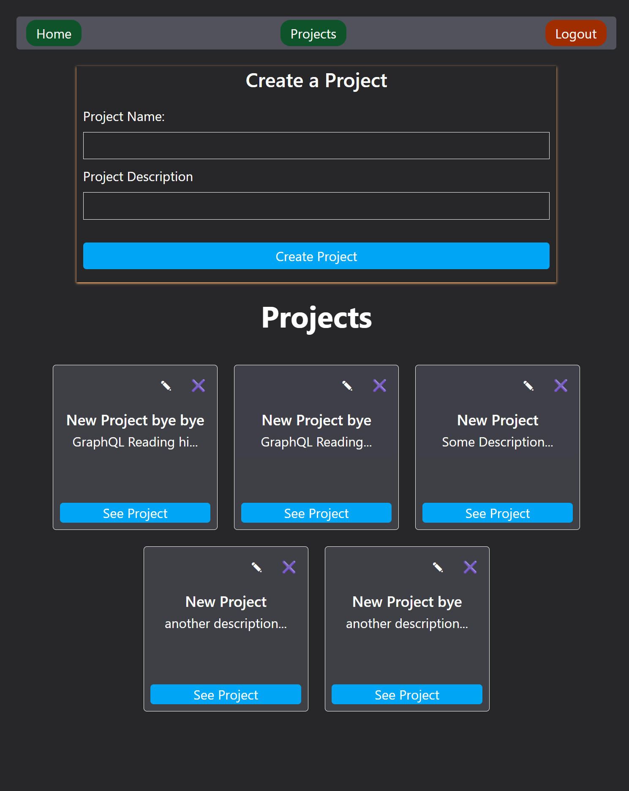

# Pro Tasker FrontEnd

This is a frontend application for managing projects and tasks. The user lands on the homepage when first visiting the website which displays a welcome message. On the navigation bar the user can login or register to start creating projects and tasks. Once the user logs in the user is directed to the projects page which has a form to create or update projects. The user can edit and delete projects or visit projects detail page for every project by clicking on "See Details" button. This page has form to create a task for that project and update and delete them.

## features
it is modular. I created seperate components for taskform, projectform, taskcard, projectcard, and navbar. The app uses routes to navigate to appropriate pages.

It is secure by storing tokens in the local storage and erasing tokens after 2 hours from local storage. It creates jwt token when the user logs in and stores it in the local storage and deletes it after the experation time. When the user logs out the backend stores the token in the not valid token list for extra security in case the token has been aquired by someone else and used after loging out.

The app uses react hooks and context to manage the state of projects and tasks and also to set the authentication state. Once the user logs in the user can see projects on the navbar and logout button to log out but can't see register and sign in buttons anymore.



## Setting up and running locally

To set up the application clone it from GitHub and install all the dependancies (note: replace anything that is wrapped in <> accordingly by whatever is mentioned inside <>):

```
git clone https://github.com/Aram-1999/pro-tasker-frontend.git <project_name>
cd <project_name>
npm install
```
Connect the backened by creating a .env file and put this code inside:
```
VITE_API_BASE_URL=<backend server URL such as http://localhost:4000>
```
Run the app:
```
npm run dev
```